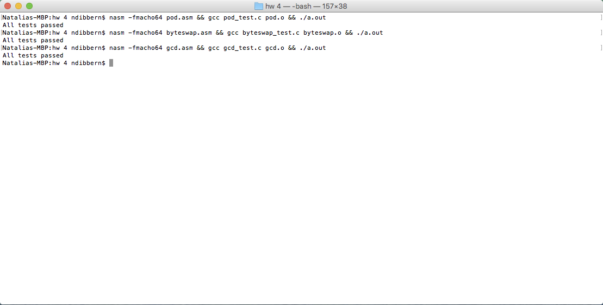

# Homework Assignment 2

## Problem 2


### Test Code

```c
#include <stdio.h>
#include <stdint.h>
#include <assert.h>

uint64_t gcd(uint64_t x, uint64_t y);

int main() {
    assert(gcd(309,66) == 3);
    assert(gcd(66, 309) == 3);
    assert(gcd(3113041662, 11570925) == 462837);
    assert(gcd(427366239731, 4273650023214) == 6499);
    assert(gcd(427366239731687, 4268765973650023214) == 1);
    puts("All tests passed");
    return 0;
}
```

### Answer Code

```asm
        global  _gcd
        section .text
_gcd:
        cmp     rsi, 0
        jne     L1
        mov     rax, rdi
        ret
L1:
        mov     rax, rdi
        xor     rdx, rdx
        div     rsi
        mov     rdi, rsi
        mov     rsi, rdx
        call    _gcd
        ret
```

## Problem 3


### Test Code

```c
#include <stdio.h>
#include <stdint.h>
#include <assert.h>

void byteswap(uint32_t *x);

int main() {
    uint32_t x = 0x3d744b26;
    byteswap(&x);
    assert(x == 0x264b743d);
    puts("All tests passed");
    return 0;
}
```

### Answer Code

```asm
        global  _byteswap
        section .text
_byteswap:
        mov     eax, [rdi]
        bswap   eax
        mov     [rdi], eax
        ret
```

## Problem 6


### Test Code

```c
#include <stdio.h>
#include <stdint.h>
#include <assert.h>

double power_of_difference(double x, double y, int32_t b);

int main() {
    assert(power_of_difference(5, 5, 20) == 0);
    assert(power_of_difference(50, 45, 10) == 9765625);
    assert(power_of_difference(206, 204, 20) == 1048576);
    assert(power_of_difference(206, 204, -3) == 0.125);
    assert(power_of_difference(-30, -26, -4) == 0.00390625);
    assert(power_of_difference(16.5, 15, 3) == 3.375);
    puts("All tests passed");
    return 0;
}
```

### Answer Code

```asm
        global   _power_of_difference
        extern   _pow
        section  .text

_power_of_difference:
        push     rbp
        subsd    xmm0, xmm1
        cvtsi2sd xmm1, edi
        call     _pow
        pop      rbp
        ret

```

# Output
The code was run in my friend's computer because I do not own a mac (That's why bash says Natalia)

