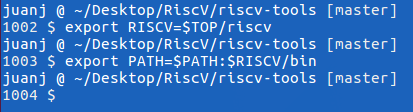

# Written report of my experience with this installation

## Assignment description

2. Go to the [RISC V website](https://riscv.org/risc-v-foundation/) and *download the RISC V ISA simulator along with the complete tool chain* **(C
compiler, assembler, linker, loader, debugger, etc.)**. Configure this software if necessary
and get it running on your computer. If successful, you will have:

- a tool chain for which you can compile C programs into RISC V binaries
- an assembler for assembling RISC V assembly programs
- a linker for linking a C main program with one or more assembly language programs
- a RISC V-ISA simulator which can run the compiled/assembled and linked generated binaries from select C and Assembly language programming assignments.

Finally, you are to submit a *written report of your experience* with this installation documenting all the hurdles and missteps you had to deal with to make this work.
The document should include output screenshots of sample C and Assembly programs compiled with the toolchain and run in simulation.

## Configuration of the software
For this part of the assignment, I followed the instructions that are available at RISC-V Tools (GNU Toolchain, ISA Simulator, Tests) [github repository](https://github.com/riscv/riscv-tools)

### Operating System Check
For the configuration of the RISC-V (pronounced “risk-five”) software instruction set architecture (ISA), and in order to get it running on my computer I used *Oracle's VM virtual box* running an image of the 16_04_02 version of Ubuntu (Xenial Xerus) available at the [archive](http://releases.ubuntu.com/16.04/) of Ubuntu's community website.


> Whether you’re an experienced technology user or you’re just getting started, there are lots of ways to get involved with the Ubuntu community. Ubuntu is more than an operating system for your computer, server, cloud, phone, tablet, or TV. It’s also a massively collaborative project. Ubuntu is always open and looking for ways to create the best possible experience for anyone who tries it and community participation is a great way to help make that happen.

Using the following built in command found in this *Linux* distribution I was able to determine the exact specifications of the system used to run this project and redirect it to a file for future reference. This can be found in the project [attachments](./system_specs.txt).
```bash
sudo lshw > system_specs.txt
```


### Set up the directory

First of all, after booting up Ubuntu, I opened bash and prepared a directory called *RiscV*, located in the Desktop, for use for this assignment by using the following command:

```bash
pwd
cd Desktop/
mkdir RiscV
cd RiscV/
export TOP=$(pwd)
```


### GCC Version

Check that `GCC --version` is newer than 4.8 for C++11 support (including thread_local).


We can see that indeed my version is newer than 4.8, being *5.4.0* as shown in the screenshots

### Obtaining and Compiling the Sources (7.87 SBU)

To obtain the necessary files to download the RISC V ISA simulator along with the complete tool chain, I had to clone the tools from the *riscv-tools* GitHub repository using the following command:

```bash
git clone https://github.com/riscv/riscv-tools.git
```

The next command brings in only references to the repositories that are needed for the installation. It took *137* minutes in my computer
```bash
cd $TOP/riscv-tools
git submodule update --init --recursive
```


I also needed to install other packages to build *GCC*, including __flex, bison, autotools, libmpc, libmpfr, and libgmp__. This step took 2 minutes and was necessary for the specific distribution of Linux that I was running.
I also had to give *super user* permission to the system to perform the command

```bash
sudo apt-get install autoconf automake autotools-dev curl libmpc-dev libmpfr-dev libgmp-dev gawk build-essential bison flex texinfo gperf libtool patchutils bc
```

I then only need to set the $RISCV environment variable, which is used throughout the build script process to identify where to install the new tools.

```bash
export RISCV=$TOP/riscv
export PATH=$PATH:$RISCV/bin
```



Because the last two steps had taken so long, _(almost two hours)_ I had to turn off the computer and go to sleep at this point _(this note will be important further on in the paper)_

With everything else set up, I just run the build script.

```bash
./build.sh
```


As can be seen in the screen above, the commannd threw the folling error.
I tried to run the command again as superuser using `sudo ./build.sh` but the problem persisted with the following output:

```
Please set the RISCV environment variable to you preferred install path
```

I then realized that the fact that I had to reboot my computer might have meant that I lost some of the macros I had set up the previous day, and that where crucial for the installation of the ISA, so I decided to run them again to see if this solved the issue.

```bash
cd RiscV/
export TOP=$(pwd)
cd $TOP/riscv-tools
export RISCV=$TOP/riscv
export PATH=$PATH:$RISCV/bin
cd ..
```


This solved the issue in 23 minutes.
Because I needed to repeat this process every time I rebooted the system to continue with the assignment, I decided to write a bash script that would automate the process for me, and that would make it more agile in the future. I used *nano* bash editor for this task:

First open nano editor:
```bash
nano setup.sh
```

Write the script:
```bash
export TOP=$(pwd)
cd $TOP/riscv-tools
export RISCV=$TOP/riscv
export PATH=$PATH:$RISCV/bin
cd ..
echo "all setup!"
```


Press <kbd>Ctr</kbd> + <kbd>x</kbd> to save and exit the program
And then <kbd>y</kbd> to accept

The resulting script can be found in the [attachments](./setup.sh)

Run the script:
```bash
sh setup.sh
```


### Testing that all is working
Write the program

```bash
cd $TOP
echo -e '#include <stdio.h>\n int main(void) { printf("Hello world!\\n"); return 0; }' > hello.c
```

Build the program with
```bash
riscv64-unknown-elf-gcc -o hello hello.c
```

When you're done, you may think to do ./hello, but not so fast. We can't even run spike hello, because our "Hello world!" program involves a system call, which couldn't be handled by our host x86 system. We'll have to run the program within the proxy kernel, which itself is run by spike, the RISC-V architectural simulator. Run this command to run your "Hello world!" program:

run using
```bash
spike pk hello
```

The RISC-V architectural simulator, spike, takes as its argument the path of the binary to run. This binary is pk, and is located at $RISCV/riscv-elf/bin/pk. spike finds this automatically. Then, riscv-pk receives as its argument the name of the program you want to run.

## Running code using the toolchain

using the command `riscv64-unknown-elf-gcc --help > riscv64_help.txt` I redirected the output of the help command to find out more about the functionality of risc V compiler. The file was named [riscv64_help.txt](./riscv64_help.txt) and can be found in the attachments. Specifically, I found an option for saving temporary files created in the different stages of c compilation `-save-temps`.

- *preprocessing* generated a hello.i file
- *compilation* generated hello.s file, containing the generated assembly instructions.
- *assembly* generated hello.o
- *linking* generated hello, an executable program
