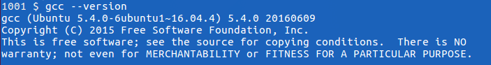
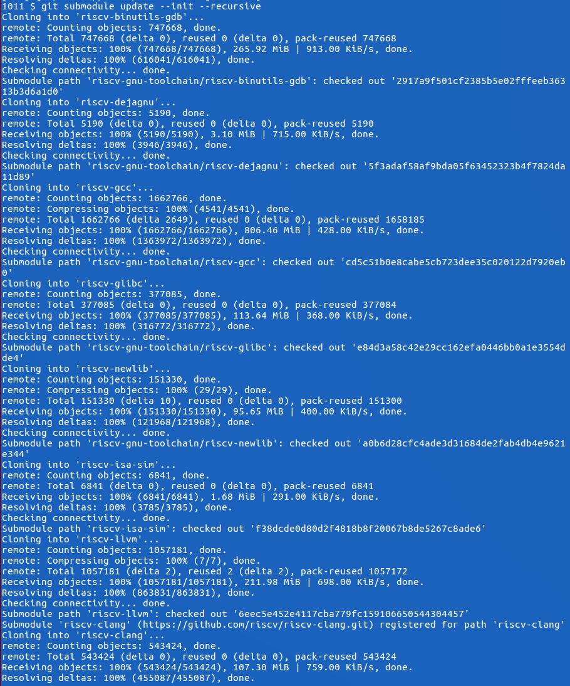

# Written report of my experience with this installation

## Assignment description

2. Go to the [RISC V website](https://riscv.org/risc-v-foundation/) and **download the RISC V ISA simulator along with the complete tool chain** *(C
compiler, assembler, linker, loader, debugger, etc.)*. Configure this software if necessary
and get it running on your computer. If successful, you will have:

- a tool chain for which you can compile C programs into RISC V binaries
- an assembler for assembling RISC V assembly programs
- a linker for linking a C main program with one or more assembly language programs
- a RISC V-ISA simulator which can run the compiled/assembled and linked generated binaries from select C and Assembly language programming assignments.

Finally, you are to submit a **written report of your experience** with this installation documenting all the hurdles and missteps you had to deal with to make this work.
The document should include output screenshots of sample C and Assembly programs compiled with the toolchain and run in simulation.

## What is RISC-V ?
RISC-V (pronounced “risk-five”) is a new instruction set architecture (ISA) that was originally designed to support computer architecture research and education and is now set to become a standard open architecture for industry implementations under the governance of the RISC-V Foundation. The RISC-V ISA was originally developed in the Computer Science Division of the EECS Department at the University of California, Berkeley.

> An instruction set, with its instruction set architecture (ISA), is the interface between a computer's software and its hardware, and thereby enables the independent development of these two computing realms; it defines the valid instructions that a machine may execute.

### What is the toolchain ?

- *riscv-gnu-toolchain*, a RISC-V cross-compiler
- *riscv-fesvr*, a "front-end" server that services calls between the host and target processors on the Host-Target InterFace (HTIF) (it also provides a virtualized console and disk device)
- *riscv-isa-sim*, the ISA simulator and "golden standard" of execution
- *riscv-opcodes*, the enumeration of all RISC-V opcodes executable by the simulator
- *riscv-pk*, a proxy kernel that services system calls generated by code built and linked with the RISC-V Newlib port (this does not apply to Linux, as it handles the system calls)
- *riscv-tests*, a set of assembly tests and benchmarks

### Useful Links
- [RISC-V Fundation Website](https://riscv.org/risc-v-foundation/)
- [interactive session of riscv-linux on a simulated RISC-V](https://riscv.org/software-tools/riscv-angel/)
- [UC Berkeley Architecture Research projects page](http://bar.eecs.berkeley.edu/projects.html)

Right now, you can download the [final user-level ISA specification](https://riscv.org/specifications/), a [draft compressed ISA specification](https://riscv.org/specifications/compressed-isa/), a [draft privileged ISA specification](https://riscv.org/specifications/privileged-isa/), and a suite of [RISC-V software tools](https://riscv.org/software-tools/)

## Configuration of the software
For this part of the assignment, I followed the instructions that are available at RISC-V Tools (GNU Toolchain, ISA Simulator, Tests) [github repository](https://github.com/riscv/riscv-tools)

### Operating System Check
For the configuration of the RISC-V (pronounced “risk-five”) software instruction set architecture (ISA), and in order to get it running on my computer I used **Oracle's VM virtual box** running an image of the 16_04_02 version of Ubuntu (Xenial Xerus) available at the [archive](http://releases.ubuntu.com/16.04/) of Ubuntu's community website.


> Whether you’re an experienced technology user or you’re just getting started, there are lots of ways to get involved with the Ubuntu community. Ubuntu is more than an operating system for your computer, server, cloud, phone, tablet, or TV. It’s also a massively collaborative project. Ubuntu is always open and looking for ways to create the best possible experience for anyone who tries it and community participation is a great way to help make that happen.

Using the following built in command found in this **Linux** distribution I was able to determine the exact specifications of the system used to run this project and redirect it to a file for future reference. This can be found in the project [attachments](./system_specs.txt).
```bash
sudo lshw > system_specs.txt
```


### Set up the directory

First of all, after booting up Ubuntu, I opened bash and prepared a directory called **RiscV**, located in the Desktop, for use for this assignment by using the following command:

```bash
pwd
cd Desktop/
mkdir RiscV
cd RiscV/
export TOP=$(pwd)
```


### GCC Version

Check that `GCC --version` is newer than 4.8 for C++11 support (including thread_local).



We can see that indeed my version is newer than 4.8, being **5.4.0** as shown in the screenshots

### Obtaining and Compiling the Sources (7.87 SBU)

To obtain the necessary files to download the RISC V ISA simulator along with the complete tool chain, I had to clone the tools from the *riscv-tools* GitHub repository using the following command:

```bash
git clone https://github.com/riscv/riscv-tools.git
```

The next command brings in only references to the repositories that are needed for the installation. It took **137** minutes in my computer
```bash
cd $TOP/riscv-tools
git submodule update --init --recursive
```



I also needed to install other packages to build **GCC**, including _flex, bison, autotools, libmpc, libmpfr, and libgmp_. This step took 2 minutes and was necessary for the specific distribution of Linux that I was running.
I also had to give **super user** permission to the system to perform the command

```bash
sudo apt-get install autoconf automake autotools-dev curl libmpc-dev libmpfr-dev libgmp-dev gawk build-essential bison flex texinfo gperf libtool patchutils bc
```

I then only need to set the $RISCV environment variable, which is used throughout the build script process to identify where to install the new tools.

```bash
export RISCV=$TOP/riscv
export PATH=$PATH:$RISCV/bin
```


Because the last two steps had taken so long, _(almost two hours)_ I had to turn off the computer and go to sleep at this point _(this note will be important further on in the paper)_

With everything else set up, I just run the build script.

```bash
./build.sh
```


As can be seen in the screen above, the command threw the following error.

```
Please set the RISCV environment variable to you preferred install path
```

I tried to run the command again as super user using `sudo ./build.sh` but the problem persisted with the following output:

I then realized that the fact that I had to reboot my computer might have meant that I lost some of the macros I had set up the previous day, and that where crucial for the installation of the ISA, so I decided to run them again to see if this solved the issue.

```bash
cd RiscV/
export TOP=$(pwd)
cd $TOP/riscv-tools
export RISCV=$TOP/riscv
export PATH=$PATH:$RISCV/bin
cd ..
```


This solved the issue in 23 minutes.
Because I needed to repeat this process every time I rebooted the system to continue with the assignment, I decided to write a bash script that would automate the process for me, and that would make it more agile in the future. I used **nano** bash editor for this task:

First open nano editor:
```bash
nano setup.sh
```

Write the script:
```bash
export TOP=$(pwd)
cd $TOP/riscv-tools
export RISCV=$TOP/riscv
export PATH=$PATH:$RISCV/bin
cd ..
echo "all setup!"
```


Press <kbd>Ctr</kbd> + <kbd>x</kbd> to save and exit the program
And then <kbd>y</kbd> to accept

The resulting script can be found in the [attachments](./setup.sh)

Run the script:
```bash
sh setup.sh
```


### Testing that all is working
To test that the envirmonment had been set up correctly and that the **instruction set architecture** was working as expected, I used a sample code available at the [RISC V website](https://riscv.org/risc-v-foundation/).

I saved the probram to a file called `hello.c` using the echo command, provided that the program was so short.

```bash
cd $TOP
echo -e '#include <stdio.h>\n int main(void) { printf("Hello world!\\n"); return 0; }' > hello.c
```


This program is supposed to output the string `hello world!` when assembled and executed correctly. Such simple and small programs are usually used by programmers to test their development environments, as we are doing in this case.

The folloiwng command builds the program using **risc v toolchain**:
```bash
riscv64-unknown-elf-gcc -o hello hello.c
```

Because the "Hello world!" program involves a system call, which couldn't be handled by the host x86 system, i needed to run the program within the proxy kernel, which itself is run by spike, the RISC-V architectural simulator. The command that does this is the following:

```bash
spike pk hello
```


The RISC-V architectural simulator, spike, takes as its argument the path of the binary to run. This binary is pk, and is located at $RISCV/riscv-elf/bin/pk. spike finds this automatically. Then, riscv-pk receives as its argument the name of the program you want to run.

As we can see in the screen above, the program works as expected and the output that was generated was the expected one.

## Running code using the toolchain

For this part of the assignment the short paper by *Yunsup Lee* found in the attachments was very helpful. This paper is also available in the attachments [here](./tut3-riscv.pdf)


It is now time to run some more serious programs and assembly code to test the capabilities of this new instruction set architecture. Because I am only used to using **nasm** to compile c code, I wanted to learn more about the functionality of this new program, so I decided to print the --help pages..

Using the command `riscv64-unknown-elf-gcc --help > riscv64_help.txt` I redirected the output of the help command to find out more about the functionality of risc V compiler. The file was named [riscv64_help.txt](./riscv64_help.txt) and can be found in the attachments. Specifically, I found an option for saving temporary files created in the different stages of c compilation `-save-temps`.


When I run the hello.c program using this option the following files where generated.


- **preprocessing** generated a `hello.i` file with some initial processing. This includes joining continued lines (lines ending with a \) and stripping comments.
- **compilation** generated `hello.s` file, containing the generated assembly instructions.
- **assembly** generated `hello.o,` by translating the assembly instructions to machine code, or object code.
- **linking** generated `hello`, an executable program


#### hello.c found [here](./hello.c)
```c
#include <stdio.h>

int main(void)
{
    printf("Hello world!\n");
    return 0;
}
```

#### hello.s found [here](./hello.s)
```asm
    .file       "hello.c"
    .option      nopic
    .section    .rodata
    .align       3
.LC0:
    .string     "Hello world!"
    .text
    .align      2
    .globl      main
    .type       main, @function
main:
    add         sp,sp,-16
    sd          ra,8(sp)
    sd          s0,0(sp)
    add         s0,sp,16
    lui         a5,%hi(.LC0)
    add         a0,a5,%lo(.LC0)
    call        puts
    li          a5,0
    mv          a0,a5
    ld          ra,8(sp)
    ld          s0,0(sp)
    add         sp,sp,16
    jr          ra
    .size       main, .-main
    .ident      "GCC: (GNU) 6.1.0"
```

Now I just need to run the generated executable file usning this command:

```bash
riscv64-unknown-elf-gcc -save-temps -o hello hello.c
spike pk hello
```
That generated the following


### Multiplication_table.c found [here](./Multiplication_table.c)

I then tried with a more complicated example that I had wrote when practicing the c programing language called **Multiplication_table** which returns the first 10 multiples of the selected number as imputed from **standard in** in the command line

```c
#include <stdio.h>
int main()
{
    int n, i;

    printf("Enter an integer: ");
    scanf("%d",&n);

    for(i=1; i<=10; ++i)
    {
        printf("%d * %d = %d \n", n, i, n*i);
    }
    return 0;
}
```

This was the output generated after running the commands:
```bash
riscv64-unknown-elf-gcc -save-temps -o multiplication_table multiplication_table.c
spike pk multiplication_table
```


### Running Assembly Code

This was the most challenging part of the assignment. For this part I had to consult the resources that were provided by the instructor *Edward Katz*. Specially useful was the [o	RISC-V Reference Card (instruction set cheat sheet)](http://www.cl.cam.ac.uk/teaching/1617/ECAD+Arch/files/docs/RISCVGreenCardv8-20151013.pdf).

I also had to take another look at the help page mentioned [above](./riscv64_help.txt) and found a very interesting option that helped me solve the problem:


I learned that by executing the following command I would be able to link assembly code, effectively generating the a.out file I was lookin for !

```bash
riscv64-unknown-elf-gcc -x assembler <NAME>.s
spike pk a.out
```

#### First test, hello world

I first tested this using my previous example: [hello.s](./hello.s)

```bash
riscv64-unknown-elf-gcc -x assembler hello.s
spike pk a.out
```

And got the expected output:


#### Second test, adding two integers

For the second test, I wrote a assembly program that would ask the user for two integers and return the sum of the two. This program was originally written to learn the language for my Computer Systems Organization class, but had to be tweaked for compatibility with RISC-V instruction set requirements.

This file is also available [here > add.s](./add.s)

```asm
    .file	"add.c"
    .option nopic
    .section	.rodata
    .align	3
.LC0:
    .string	"Enter two integers: "
    .align	3
.LC1:
    .string	"%d %d"
    .align	3
.LC2:
    .string	"%d + %d = %d"
    .text
    .align	2
    .globl	main
    .type	main, @function
main:
    add	sp,sp,-32
    sd	ra,24(sp)
    sd	s0,16(sp)
    add	s0,sp,32
    lui	a5,%hi(.LC0)
    add	a0,a5,%lo(.LC0)
    call	printf
    add	a4,s0,-28
    add	a5,s0,-24
    mv	a2,a4
    mv	a1,a5
    lui	a5,%hi(.LC1)
    add	a0,a5,%lo(.LC1)
    call	scanf
    lw	a4,-24(s0)
    lw	a5,-28(s0)
    addw	a5,a4,a5
    sw	a5,-20(s0)
    lw	a5,-24(s0)
    lw	a4,-28(s0)
    lw	a3,-20(s0)
    mv	a2,a4
    mv	a1,a5
    lui	a5,%hi(.LC2)
    add	a0,a5,%lo(.LC2)
    call	printf
    li	a5,0
    mv	a0,a5
    ld	ra,24(sp)
    ld	s0,16(sp)
    add	sp,sp,32
    jr	ra
    .size	main, .-main
    .ident	"GCC: (GNU) 6.1.0"
```

The original file that needed to be modified is also available [here > add_original.s](./add_original.s)

```asm
    .file	"add.c"
    .section	.rodata
.LC0:
    .string	"Enter two integers: "
.LC1:
    .string	"%d %d"
.LC2:
    .string	"%d + %d = %d"
    .text
    .globl	main
    .type	main, @function
main:
    .LFB0:
    .cfi_startproc
    pushq	%rbp
    .cfi_def_cfa_offset 16
    .cfi_offset 6, -16
    movq	%rsp, %rbp
    .cfi_def_cfa_register 6
    subq	$32, %rsp
    movq	%fs:40, %rax
    movq	%rax, -8(%rbp)
    xorl	%eax, %eax
    movl	$.LC0, %edi
    movl	$0, %eax
    call	printf
    leaq	-16(%rbp), %rdx
    leaq	-20(%rbp), %rax
    movq	%rax, %rsi
    movl	$.LC1, %edi
    movl	$0, %eax
    call	__isoc99_scanf
    movl	-20(%rbp), %edx
    movl	-16(%rbp), %eax
    addl	%edx, %eax
    movl	%eax, -12(%rbp)
    movl	-16(%rbp), %edx
    movl	-20(%rbp), %eax
    movl	-12(%rbp), %ecx
    movl	%eax, %esi
    movl	$.LC2, %edi
    movl	$0, %eax
    call	printf
    movl	$0, %eax
    movq	-8(%rbp), %rsi
    xorq	%fs:40, %rsi
    je	.L3
    call	__stack_chk_fail
.L3:
    leave
    .cfi_def_cfa 7, 8
    ret
    .cfi_endproc
```

And here is the output of running the same command on this file:

```bash
riscv64-unknown-elf-gcc -x assembler add.s
spike pk a.out
```


